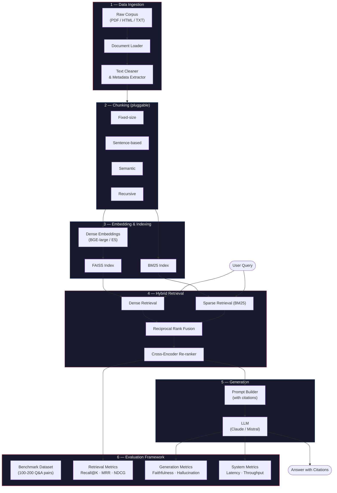

# RAG Engine — Production-Grade Retrieval-Augmented Generation with Evaluation

A retrieval-augmented generation system built from scratch (no LangChain), featuring hybrid retrieval, cross-encoder re-ranking, multiple chunking strategies, and a quantitative evaluation framework with ablation studies.

Built on **Indian Supreme Court judgments** (~35,000 cases, 1950–2025) sourced from the [AWS Open Data Registry](https://registry.opendata.aws/indian-supreme-court-judgments/) (CC-BY-4.0).

## Architecture



## Quick Start

```bash
# Clone and install
git clone https://github.com/yshdeshpande/rag-engine.git
cd rag-engine
uv venv && source .venv/bin/activate
uv pip install -e ".[dev]"

# Download corpus (2020-2024, ~3,900 PDFs, ~1.6 GB)
python scripts/download_data.py

# Or start with a single year (~240 MB)
python scripts/download_data.py --years 2020

# Run ingestion pipeline
python scripts/run_ingestion.py
```

## Corpus

| Detail | Value |
|---|---|
| Source | Indian Supreme Court Judgments (AWS Open Data) |
| Format | PDF (English) + Parquet metadata |
| Volume | ~35,000 judgments (1950–2025) |
| License | CC-BY-4.0 |
| Metadata | Title, petitioner, respondent, judge, citation, decision date |

## Project Structure

```
src/
├── ingestion/      # PDF loader (pymupdf), text cleaner, metadata enrichment
├── chunking/       # Pluggable strategies: fixed-size, sentence-based, semantic, recursive
├── retrieval/      # Dense (FAISS), sparse (BM25), hybrid (RRF) + cross-encoder re-ranker
├── generation/     # Prompt templates, LLM generation with citations
├── evaluation/     # Retrieval & generation metrics, benchmark runner
└── pipeline.py     # End-to-end orchestration
```

## Progress

- [x] Repo structure, config, Makefile
- [x] Data download script (AWS S3)
- [x] Ingestion pipeline (load, clean, enrich, store)
- [x] Fixed-size chunking
- [x] Sentence-based chunking (NLTK)
- [ ] Recursive chunking
- [ ] Semantic chunking
- [ ] Dense + sparse retrieval
- [ ] Hybrid retrieval (RRF)
- [ ] Cross-encoder re-ranking
- [ ] LLM generation with citations
- [ ] Evaluation framework
- [ ] Ablation studies + results
- [ ] FastAPI serving endpoint

## Results

> _Results tables and charts will be added as experiments are completed._

## Lessons Learned

> _To be updated as the project progresses._

## Future Work

- Query decomposition for multi-hop questions
- Contextual compression of retrieved passages
- Fine-tuned embedding models on domain-specific data
- Streaming generation with FastAPI WebSockets
